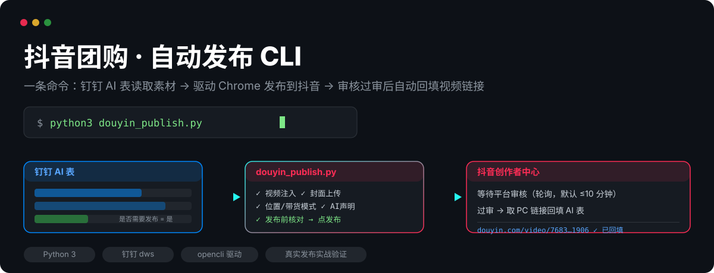
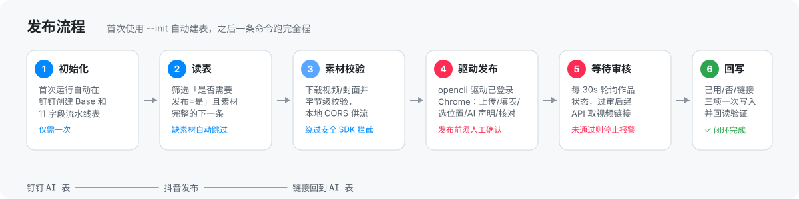

<p align="center">
  
</p>

# 抖音团购自动发布 CLI

**一条命令，把钉钉 AI 表里的团购视频发布到抖音，审核过审后自动把视频链接回填回 AI 表。**

单文件 Python 脚本（`douyin_publish.py`），无第三方依赖。由 AI Agent（千问办公 + opencli）实战校准并验证过完整发布链路——本项目即从一条真实发布的团购视频（2026-09-08，审核通过、链接回填成功）沉淀而来。

## 它解决什么问题

本地生活/团购运营团队通常这样发视频：素材散落在协作表格里，人工逐条下载视频和封面、登录抖音创作者中心上传、填写标题简介、搜索门店位置、勾选 AI 声明、点发布，发完还要回头把表格状态改掉。一条视频 5-10 分钟，几十条就是半天。

本 CLI 把这条链路自动化：**钉钉 AI 表是唯一的数据源**，脚本读表取素材、驱动你已登录的 Chrome 完成整个发布流程、等待平台审核、把视频 PC 链接回填到表里。整个过程发布前有人工确认门禁，失败即停不会重复发布。

## 工作流程

<p align="center">
  
</p>

脚本实际执行的动作（全部经过实战校准）：

- **素材注入**：页面内 `DataTransfer` 注入视频/封面（抖音安全 SDK 拦截外部 fetch，脚本自动起本地 CORS 服务绕过）
- **表单填写**：作品标题（30 字截断）、简介、竖版封面（自动跳过横封面）、位置-带货模式-国内门店 POI（名称精确匹配才选中）、自主声明「内容由AI生成」
- **发布前核对**：标题/简介/位置/视频/封面/AI 声明逐项比对 AI 表数据，全部通过才允许点发布
- **审核等待**：每 30 秒轮询作品状态，过审后经创作者中心 API 取 `item_id_plain` 拼出 PC 链接；审核未通过则停止并报警，不回写
- **闭环回写**：`素材是否已用=已用`、`是否需要发布=否`、`视频链接=PC链接` 一次写入并回读验证

## 快速开始

### 1. 安装依赖

```bash
# Python 3 自带即可，脚本无 pip 依赖

# dws —— 钉钉工作台 CLI（读写 AI 表用）
npm install -g dingtalk-workspace-cli
dws    # 首次运行按提示授权你的钉钉账号

# opencli —— 驱动已登录的 Chrome
npm install -g @jackwener/opencli
# 从 https://github.com/jackwener/OpenCLI/releases 下载 Browser Bridge 扩展 zip 并解压
# Chrome 打开 chrome://extensions/ → 开发者模式 → 加载已解压的扩展程序 → 选中解压目录
opencli doctor   # Daemon / Extension / Connectivity 三项 OK 即就绪
```

### 2. 初始化（首次使用）

```bash
python3 douyin_publish.py --init
```

脚本会在你的钉钉组织中自动创建 Base「**抖音团购发布**」和数据表「**团购视频发布流水线**」（11 个字段含选项），并把字段配置存到 `~/.douyin_publisher.json`。

然后打开表格做两件事：
1. 把「推广门店位置」的示例选项改成你的真实门店（可加多个）
2. 把「发布账户」的示例选项改成你的抖音号名

### 3. 添加待发布记录

在表格里添加记录，填齐这些字段后把「是否需要发布」设为**是**：

| 字段 | 类型 | 说明 |
|---|---|---|
| 推广门店位置 | 多选 | 门店 POI，发布时搜索选中（名称需与抖音 POI 一致） |
| 作品标题 | 文本 | 自动截断至 30 字 |
| 作品简介 | 文本 | 支持话题标签 `#xxx` |
| 视频输出 | 附件 | 待发布的视频文件 |
| 视频封面 | 附件 | 竖版封面图 |
| 是否需要发布 | 单选 | 设为「是」才会被脚本处理 |
| 素材是否已用 / 视频链接 | 单选 / 链接 | 脚本发布成功后自动回写，无需手填 |

### 4. 确保 Chrome 已登录抖音创作者中心

打开 [creator.douyin.com](https://creator.douyin.com) 并登录（发布用的抖音号要与表格「发布账户」一致）。Chrome 保持运行即可。

### 5. 发布

```bash
python3 douyin_publish.py                # 取下一条待发布记录，发布前交互确认
python3 douyin_publish.py --record-id XX # 指定记录
python3 douyin_publish.py --no-publish   # 只填表不点发布，先人工检查
python3 douyin_publish.py --review-timeout 900   # 审核等待上限调到 15 分钟
```

## 参数一览

| 参数 | 说明 |
|---|---|
| `--init` | 仅初始化：创建钉钉 AI 表 + 生成配置后退出 |
| `--record-id ID` | 指定要发布的记录（默认取第一条完整待发布记录） |
| `--yes` | 跳过发布前确认（慎用，会直接真实发布） |
| `--no-publish` | 填完表单停在发布前（校准/演示用） |
| `--review-timeout SEC` | 审核等待上限秒数（默认 600） |

## 安全设计

- **发布门禁**：默认每条视频发布前需终端输入 `y` 确认；`--no-publish` 可全程演练不发布
- **失败即停**：上传失败、触发安全验证、审核未通过、确认超时——任何一步失败都不回写、不自动重试，避免重复发布
- **发布确认**：点击发布后以「跳转作品管理页」为成功标志，超时则明确提示人工核对、勿重跑
- **字节校验**：视频/封面下载后校验字节数与文件头，防止损坏素材发出
- **数据只进你自己的组织**：AI 表创建在你授权的钉钉组织内，配置存本地 `~/.douyin_publisher.json`

## 已知边界

- 单次处理 1 条记录（防止批量误发）；发多条就多跑几次，每条都会重新确认
- 发布账号 = Chrome 当前登录的抖音号；换号需先在 Chrome 切换登录
- 触发抖音安全验证（短信/滑块）时脚本停止，需人工处理后重跑该记录
- 「推广门店位置」依赖抖音 POI 搜索，门店名与抖音 POI 名称需一致（如「xx银泰百货」）

## License

[MIT](LICENSE)
